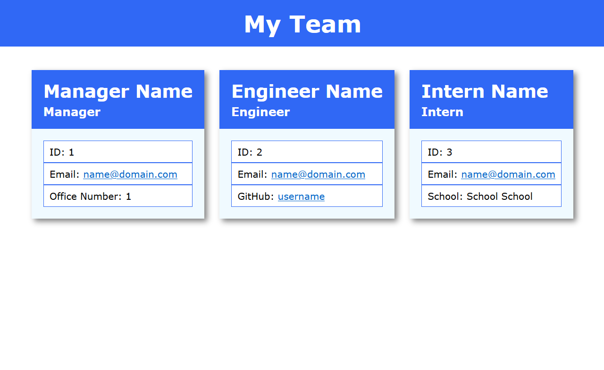

# Team Profile Generator

## Description

This program is used to generate a simple website that labels and keeps track of any and all employees on staff or on a certain project. The site labels each team member by role, empoyee ID, email, and a third type of data based on their role. For managers, their office number. For engineers, their GitHub username. For interns, the school they're studying at. 

## Table of Contents

- [Installation](#installation)
- [Usage](#usage)
- [Credits](#credits)
- [License](#license)
- [Contribution](#contribution)
- [Questions](#questions)

## Installation

1. Install [Node.js](https://nodejs.org/en/)
2. Download the Team Profile Generator

## Usage

1. Navigate to the project directory in your console
2. Type the following code into your console to install the necessary dependencies: 

        npm install

3. Type the following code into your console to run the program: 

        node index.js
    
4. Select the type of employee you want to add
5. Answer all prompts
6. If you want to add another employee, select the option to add another employee and repeat steps 4-5
7. Once you've added all employees, select the option to not add another employee and wait for your site to generate
8. Enjoy your Team Profile website!

## Credits

Built for use with [Node.js](https://nodejs.org/en/)
 Built in part using [Inquirer](https://www.npmjs.com/package/inquirer/v/8.2.4)
 Tested using [Jest](https://www.npmjs.com/package/jest)

## License

This software is covered by the MIT license.

## Contribution

Currently, this is a solo developer project.

## Questions

Any questions about this software can be directed to the author via
Github: https://github.com/joshmusto